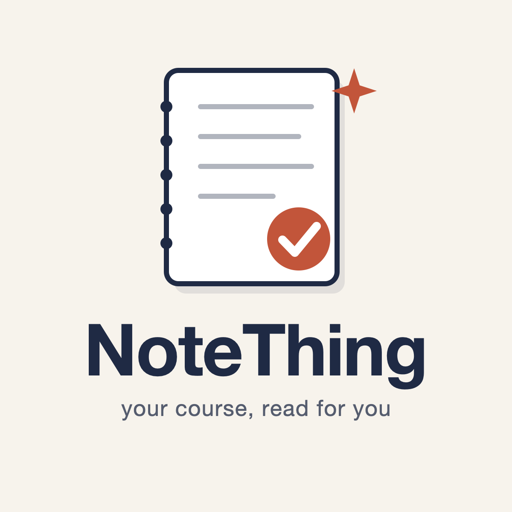
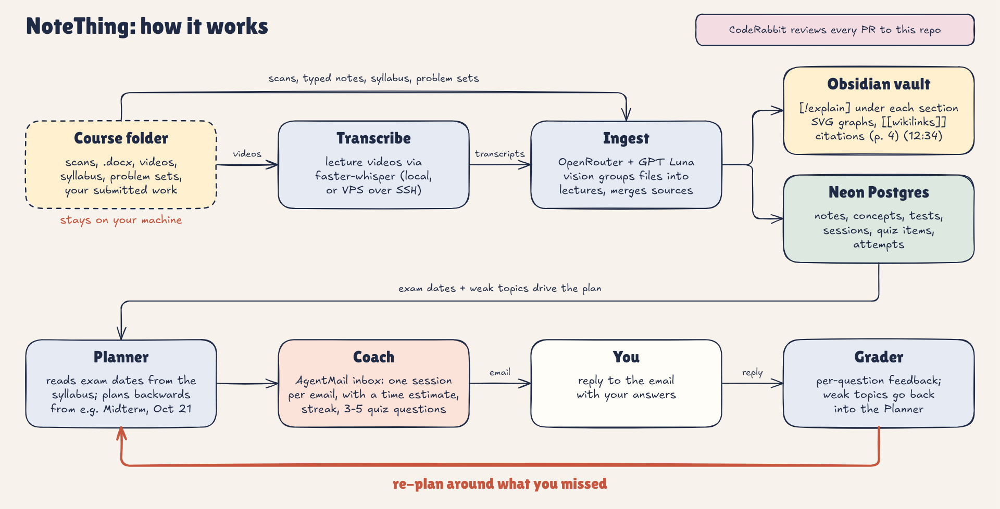

<p align="center"></p>

# NoteThing

**Your course, read for you.** Study notes + a prep schedule that shows up in your inbox.

Drop your course into a folder: the professor's scanned handwritten notes, the lecture videos, the syllabus, the problem sets. NoteThing reads all of it, writes clean Obsidian study notes (with a plain-English explanation under every section and the prof's graphs redrawn as SVG), then works back from your test dates and emails you one study session at a time, like a coach. Reply with your answers; it grades them, re-explains what you missed, and moves your weak topics up the schedule.

## How it works



1. **Ingest** walks `content/<course>/` recursively and classifies every file (filename hints, then a cheap model call if unsure): `notes`, `video`, `syllabus`, `problemset`, `student_work` (and `slides`).
2. **Lectures are grouped** by topic folder + filename stem, so `BudgetConstraint_Scanned.pdf` + `BudgetConstraints.docx` + `video_BC_part1.mp4` become **one** "Budget Constraint" note. Typed notes give accurate text, the scans give graphs and handwritten extras, the transcript gives what the prof actually said, cited by timestamp `(12:34)` or page `(p. 4)`.
3. **The syllabus** becomes test dates; **problem sets** become exam-style quiz grounding; **your own submitted work** is graded against the solutions to seed your weak topics before session 1.
4. **Plan** schedules sessions from today to each test: learn new lectures, practice every other day, full review the day before.
5. **Coach emails** (via AgentMail) say what to read, how long it'll take, your streak and accuracy by topic, and 3-5 quiz questions. Reply in plain text; you get per-question feedback, a short re-explanation for every miss, and those questions come back in your next session.

## Setup

```bash
git clone <this repo> && cd notething
pnpm install
cp .env.example .env   # fill in the keys below
pnpm migrate
```

| Variable | What |
|---|---|
| `OPENROUTER_API_KEY` | [OpenRouter](https://openrouter.ai/keys) API key (all model calls go through it) |
| `AGENTMAIL_API_KEY` | AgentMail API key |
| `AGENTMAIL_INBOX` | Optional: inbox to send from. Leave blank and run `pnpm inbox` to create `notething@agentmail.to` |
| `STUDENT_EMAIL` | Where sessions are emailed |
| `STUDENT_NAME` | Optional: your name, so files like `Jane_Doe_PS1.pdf` are recognized as your own work |
| `DATABASE_URL` | Neon Postgres connection string |
| `VAULT_DIR` | Optional: point at your Obsidian vault (default `./vault`) |
| `OBSIDIAN_VAULT` | Optional: that vault's name in Obsidian. Emails then link each note; without it they show just the note title |
| `NOTETHING_MODEL` | Any OpenRouter model id that accepts image + file input (default `openai/gpt-6-luna`) |
| `NOTETHING_CHEAP_MODEL` | Model for file classification (default `openai/gpt-5-nano`) |
| `STUDY_HOUR` | Local hour sessions are scheduled (default 18) |
| `WHISPER_MODEL` | faster-whisper model (default `small`) |
| `TRANSCRIBE_SSH_HOST` | Optional: transcribe on a remote box over SSH instead of locally |

**Video transcription** runs locally by default with [`uv`](https://docs.astral.sh/uv/) (`uv run --with faster-whisper scripts/transcribe.py`); ffmpeg is used if present, otherwise PyAV decodes the audio. Set `TRANSCRIBE_SSH_HOST` (and optionally `TRANSCRIBE_PYTHON`, default `~/notething-venv/bin/python`) to run it on a VPS instead: the file is uploaded to `/tmp/notething/`, transcribed, copied back, and deleted from the server. Transcripts are cached in `content/<course>/.transcripts/`. Put lecture URLs in `content/<course>/videos.txt` (one per line) to fetch them with yt-dlp.

## Commands

```bash
pnpm ingest [course]     # files -> Obsidian notes in vault/<course>/, tests, problem sets
pnpm plan [course]       # build the session schedule toward each test
pnpm send-next           # email the next due session
pnpm poll                # grade replies, send feedback, re-weight the plan
pnpm fast-forward 3      # demo: jump the clock and send the next 3 sessions now
pnpm start               # loop: ingest new files, send due sessions, poll replies every 60s
pnpm inbox               # create/show the AgentMail inbox
```

## Privacy

Your course materials never enter this repo: `content/`, `vault/` and `.env` are gitignored. Files go only to OpenRouter (and the model provider it routes to) for processing (and to your own machine or VPS for transcription). The repo contains only code.

## Built with

- [OpenRouter](https://openrouter.ai): one API for the models that read handwriting and graphs, write notes, quizzes and grades
- [Neon](https://neon.tech): serverless Postgres for courses, notes, sessions and attempts
- [AgentMail](https://agentmail.to): the coach's inbox; sends sessions and receives your replies
- [CodeRabbit](https://coderabbit.ai): reviews every PR
- [faster-whisper](https://github.com/SYSTRAN/faster-whisper): lecture transcription

## License

MIT © 2026 Nolan Druid
